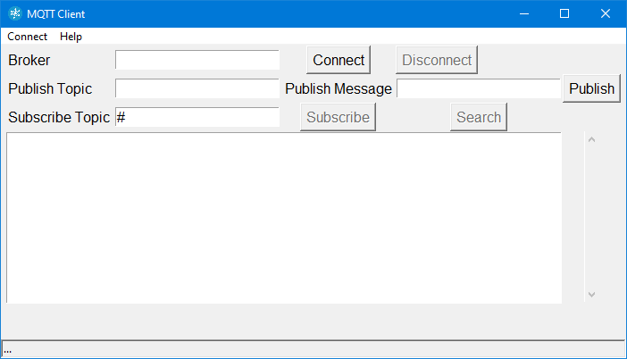
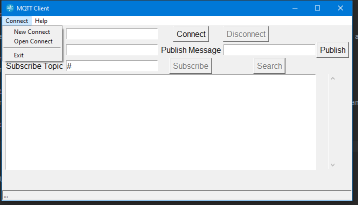
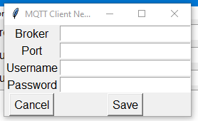
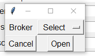
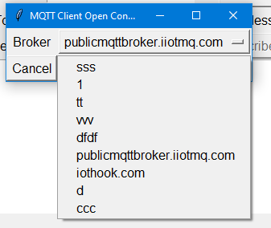
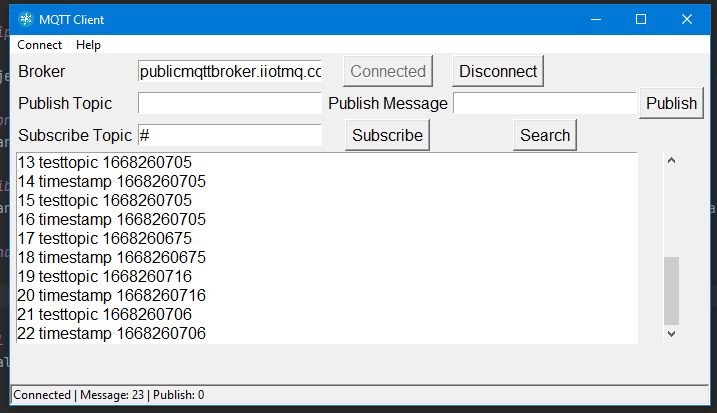
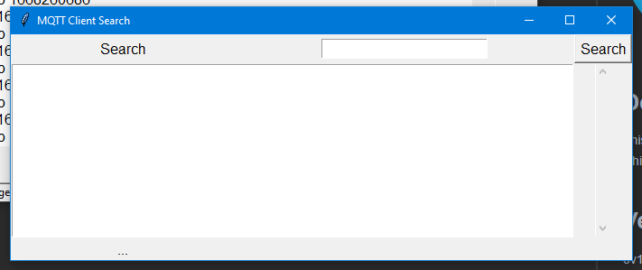
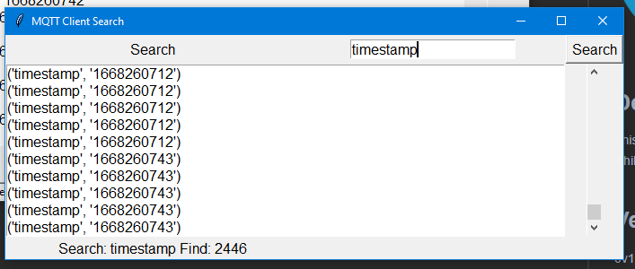

# MQTT Client

## Description

This project was developed with Python and Tkinter to subscribe to topics and messages, broadcast and search incoming messages while developing a project with the MQTT protocol.

## Version History
0v1 : Start project

## Contributing
If you want to be included in the project, please copy it and make the changes you see necessary and submit.

## Use and Operation

# Install
pip install mqttclient
